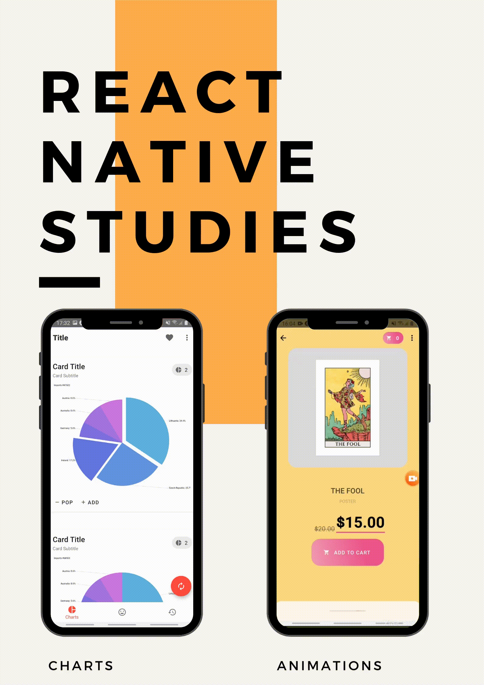

# React Native Studies

Learning cool new react native techniques!! ⚛️📱️

## Getting Started

This repo contains UI projects that apply spring animations, cross web compatibility, data presentation, styles, and many others techniques to RN!



## Animations Project

This experiment makes use of react spring to create fluid mobile animations!

### Installation & Run

Clone this repo!

```
	git clone <repo>
	cd <repo>
```

To install the animations project, run:

```
cd animations
yarn install
yarn start
```

### Features

- Spring animations;
- Gesture;
- Advanced CSS;
- Animation performace.

### Build With

- Expo/React Native;
- React Spring.

## Charts Project

_How could you make your app interact with a non compatible library?_ This project try to solve this problem with minimum use of webviews!!

### Installation & Run

Clone this repo!

```
	git clone <repo>
	cd <repo>
```

To install the charts project, run:

```
cd charts
yarn install
yarn start
```

### Features

- Integration with non-compatible libs;
- Minimum use of webview;
- Integration between native and webview.

### Build With

- Expo/React Native;
- React Native Webview;
- AmCharts 4.
